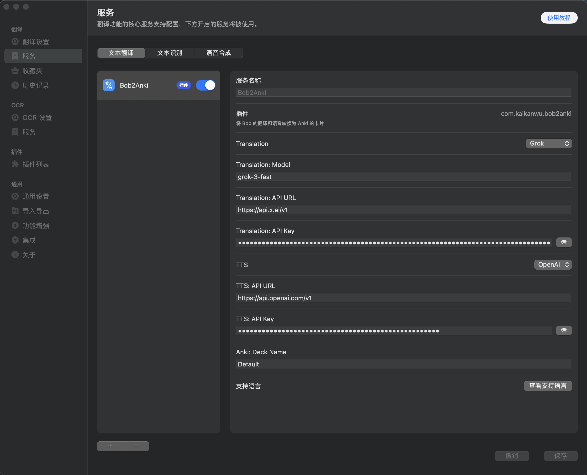

# Bob2Anki
An Anki card should follow the [Minimum information principle](https://supermemo.guru/wiki/Minimum_information_principle).

## Features
Testing:
- Basic translation.
- Pronunciation.
- Add to Anki, and specify the deck name.
- Support OpenAI API.

Not yet:
- Support more AI providers.
- Stream response.
- Improve prompt.

## How to use
1. Install [Anki Connect](https://git.foosoft.net/alex/anki-connect), and keep Anki running.
2. Apply your OpenAI API key.
3. [Install](https://bobtranslate.com/guide/advance/plugin.html) this plugin on Bob, and fill the config.

